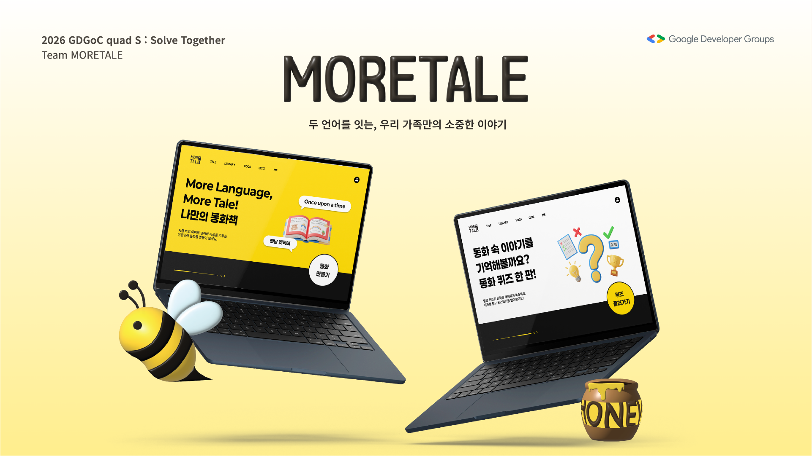
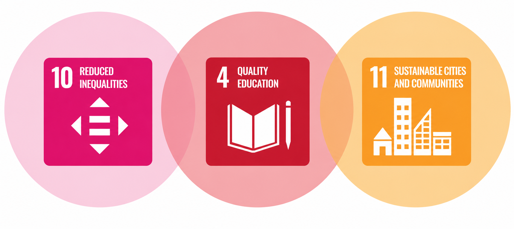
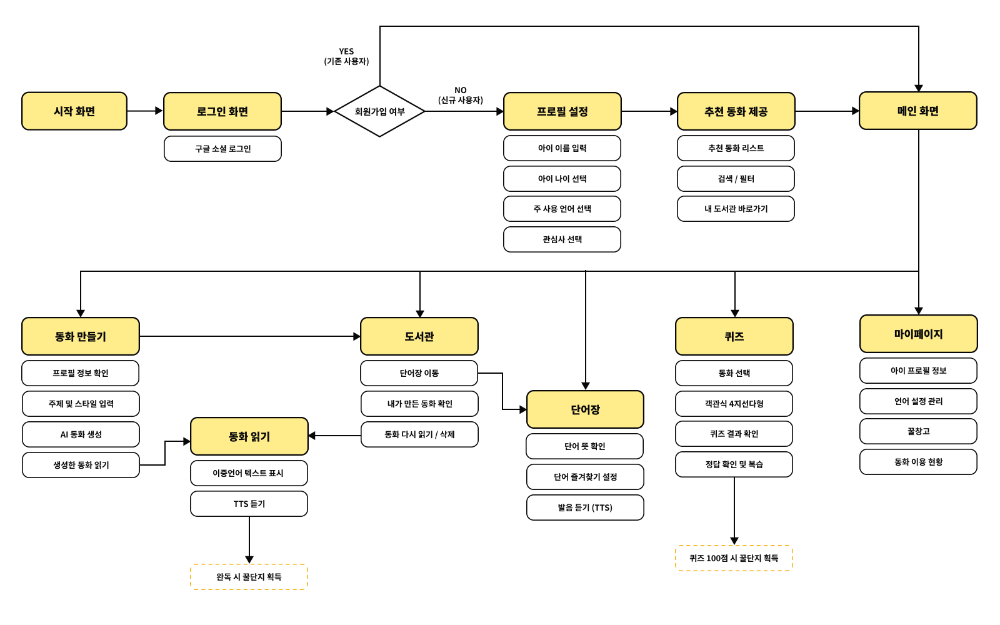
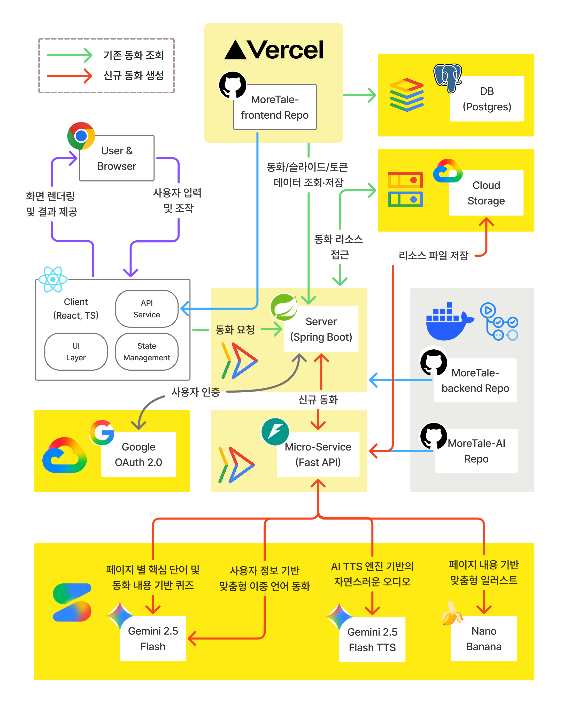
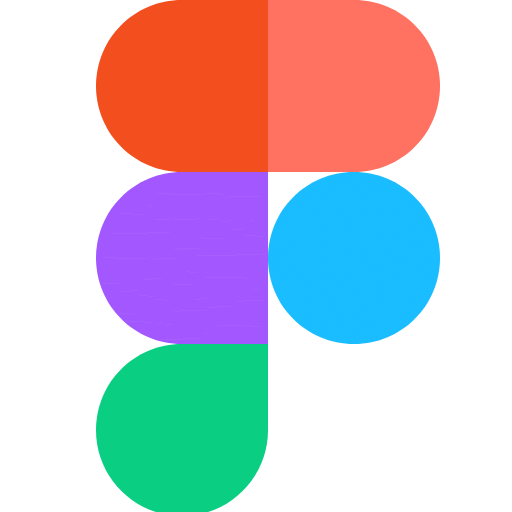
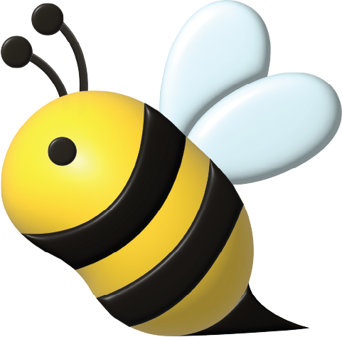
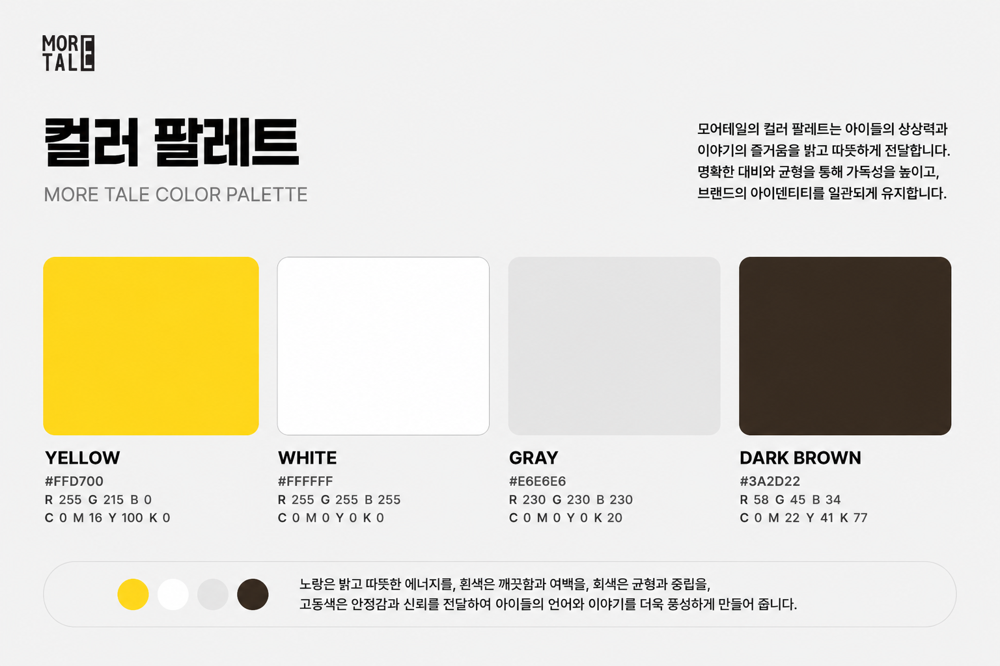

 

    

        <h1><b>MORETALE</b></h1>
        
<i>More Language, More Tale!</i>

    

 

**다문화 가정의 아이와 부모가 함께 읽고 듣는 AI 이중언어 동화 플랫폼**

언어가 다르면 대화가 줄어들고, 대화가 줄어들면 서로를 이해할 기회도 줄어듭니다.

**MORETALE**은 다문화 가정의 부모와 아이가 함께 이야기를 만들고 읽으며 두 언어를 자연스럽게 배우고 서로의 문화와 정체성을 이해할 수 있도록 돕는 AI 기반 스토리텔링 플랫폼입니다.

아이의 이름, 나이, 언어 수준, 관심사를 바탕으로 세상에 하나뿐인 이중언어 동화를 생성하고, 읽기·듣기·퀴즈·단어 학습까지 하나의 이야기 안에서 경험할 수 있도록 설계했습니다.

우리는 모든 아이가 자신의 언어와 문화를 소중하게 여기며 성장할 수 있는 세상을 꿈꿉니다.
 

---

## 🚨 Problem Statement

<blockquote align='center'>
<h3>

“Children learn best when they can learn in a language they understand.”

\- UNESCO, <i>2025 Global Guidance on Multilingual Education</i>

</h3>
</blockquote>

국내 다문화 학생 수는 20만 명을 넘어섰고 외국인 가정 자녀 수는 최근 5년 사이 2.2배 증가했습니다. 하지만 다문화 가정의 급격한 증가에도 불구하고 가정 내 언어 교육과 정서적 지원 환경은 여전히 충분하지 않은 상황입니다.

대한민국 여성가족부의 2024년 전국 다문화가족 실태조사(2025.07.31)에 따르면, 만 5세 이하 자녀를 둔 부모의 72.7%가 양육의 어려움을 겪고 있으며 17.8%는 자녀에게 한국어를 직접 가르치는 데 어려움을 느끼고 있습니다. 학령기 자녀를 둔 부모의 78.2%가 양육 부담을 경험하고 있고 19.7%는 학습 지도에, 4.4%는 자녀와의 대화에 어려움을 겪고 있다고 응답했습니다.

이러한 문제는 한국만의 문제가 아닙니다. UNESCO에 따르면 전 세계 인구의 약 40%는 자신이 이해하는 언어로 교육받지 못하고 있으며, 일부 국가에서는 그 비율이 90%에 달합니다. 전 세계 약 7,000개의 언어 중 실제 교육에 활용되는 언어는 351개에 불과합니다.

UNESCO와 UNICEF는 아이가 이해할 수 있는 언어로 배우는 환경과 가족의 적극적인 참여가 아동의 성장과 학습에 중요한 역할을 한다고 강조합니다. 또한 영유아기의 교육 경험은 평생의 학습 역량과 사회적 기회의 기반이 됩니다. 그러나 다문화 가정이 일상 속에서 함께 활용할 수 있는 이중언어 교육 콘텐츠와 가족 중심 학습 경험은 여전히 부족합니다.

이러한 현실은 MORETALE과 같은 가족 참여형 이중언어 학습 경험의 필요성을 보여줍니다.

---

## 💡 Our Solution

> MORETALE은 다문화 가정의 언어 장벽과 정서적 거리감을 해결하기 위해 AI 기반 이중언어 스토리텔링 경험을 제공합니다.

> 각 가정의 언어와 문화적 특성을 반영한 맞춤형 동화를 생성하고, 동화 속 단어 학습, 퀴즈, 음성(TTS) 기능을 하나의 경험으로 연결하여 지속적인 언어 학습을 지원합니다.

### 🌍 Bilingual Learning

- 한국어와 부모의 모국어를 함께 활용한 이중언어 콘텐츠를 제공하여 아이가 두 언어와 문화를 자연스럽게 경험할 수 있도록 지원합니다.

### 📖 Story-Based Learning

- 동화는 아이가 가장 쉽고 즐겁게 몰입할 수 있는 학습 매체입니다. 
- MORETALE은 가족이 함께 이야기를 읽고 공유하는 경험을 통해 언어 학습과 정서적 교감을 동시에 제공합니다.

### 🤖 AI Personalization

- 모든 가정의 언어와 문화적 배경은 다릅니다. 
- 생성형 AI를 활용하여 아이 한 명 한 명에게 맞는 맞춤형 동화를 생성함으로써 개인화된 학습 경험을 제공합니다.

---

## 🌍 Global Impact & SDGs

> MORETALE은 다문화 가정의 언어 장벽과 정서적 단절 문제를 해결하며 다음과 같은 지속가능발전목표(SDGs)에 기여합니다.

#### 🎓 ${\textsf{\color{red}Target\ 4.5:\ Inclusive\ Bilingual\ Education}}$

다문화 가정의 아동은 언어적·문화적 배경으로 인해 교육 기회와 학습 경험에서 불평등을 겪을 수 있습니다. MORETALE은 아이의 언어 수준과 관심사를 반영한 AI 기반 이중언어 동화를 제공합니다. 읽기·듣기·퀴즈 활동을 하나의 이야기 안에 담아 가정 환경에 관계없이 양질의 학습 경험을 제공하고 지속적인 언어 학습을 지원합니다.

#### 🤝 ${\textsf{\color{magenta}Target\ 10.2:\ Promoting\ Social\ Inclusion}}$

언어의 차이는 교육 격차를 넘어 사회적 소외와 문화적 단절로 이어질 수 있습니다. MORETALE은 다문화 가정 아동이 자신의 언어와 문화를 긍정적으로 받아들일 수 있도록 돕습니다. 다양한 언어와 문화에 대한 접근 기회를 넓히고 서로의 차이를 이해하고 존중하는 경험을 제공합니다.

#### 🏙 ${\textsf{\color{orange}Target\ 11.4:\ Preserving\ Cultural\ Heritage}}$

언어는 세대의 경험과 문화를 전달하는 중요한 자산입니다. MORETALE은 부모의 모국어와 문화적 배경을 동화 속 이야기로 담아냅니다. 아이는 가족의 언어와 문화를 자연스럽게 접하고, 가족은 이야기를 통해 서로의 경험과 정체성을 공유하며 문화적 다양성을 다음 세대로 이어갈 수 있습니다.

---

## 🎥 Demo Video

---

## ✨ Key Features

> MORETALE은 동화 생성부터 읽기, 듣기, 단어 학습, 퀴즈, 보상까지 하나의 흐름으로 연결된 이중언어 학습 경험을 제공합니다.

### 👤 Google Login & Onboarding

- 사용자는 Google 계정으로 간편하게 로그인한 뒤, 아이의 언어 환경과 관심사에 맞는 프로필을 설정합니다. 
- 온보딩 과정에서 입력된 정보는 맞춤형 동화 추천과 생성에 활용됩니다.

### 📖 AI Bilingual Story Generation

- 사용자가 입력한 주제와 프로필 정보를 바탕으로 AI가 맞춤형 이중언어 동화를 생성합니다. 
- 각 동화는 여러 개의 슬라이드로 구성되며, 이미지와 두 언어의 텍스트를 함께 제공합니다.

    
    

### 📚 Story Reading Experience

- 생성된 동화는 슬라이드 형식으로 제공됩니다. 
- 아이와 부모는 같은 화면에서 두 언어의 문장을 함께 읽으며, 자연스럽게 서로의 언어와 문화를 접할 수 있습니다.

### 🔊 Text-to-Speech Narration

- MORETALE은 각 언어별 TTS 음성을 제공합니다. 
- 부모가 직접 읽어주기 어려운 상황에서도 아이는 동화를 들으며 언어의 발음과 리듬을 자연스럽게 익힐 수 있습니다.

📻 <a href="https://drive.google.com/file/d/1uBPh3_xFa9vfkD9M4J_TFI-dpVWr_sZ4/view?usp=sharing">
TTS 시연 영상 보기
</a>

### 📝 Vocabulary Learning

- 동화 속 주요 단어를 저장하고 학습할 수 있습니다. 
- 아이들은 이야기 안에서 만난 단어를 다시 확인하며, 문맥 속에서 자연스럽게 어휘를 익힐 수 있습니다.

  

### 🧠 Interactive Quiz

- 동화를 읽은 뒤, 이야기 내용과 주요 단어를 바탕으로 퀴즈를 풉니다. 
- 퀴즈는 아이가 동화를 얼마나 이해했는지 확인하고 학습 내용을 복습할 수 있도록 돕습니다.

    
    

### 🍯 Honey Jar Reward System

- 동화 완독과 퀴즈 풀이를 통해 꿀단지 보상을 받을 수 있습니다.
- 보상 시스템은 아이가 지속적으로 동화를 읽고 학습에 참여할 수 있도록 동기를 제공합니다.

### 🏛 Personal Library

- 생성한 동화는 개인 도서관에 저장됩니다. 
- 아이와 가족은 함께 만든 이야기를 다시 꺼내 읽으며, 언어 학습의 기록이자 가족의 추억으로 쌓아갈 수 있습니다.

---

## 🔄 User Flow

---

## ⚙️ Architecture

  

---

## 🛠 Tech Stack

<a href="https://react.dev/">
<kbd>

</kbd>
</a>

<a href="https://www.typescriptlang.org/">
<kbd>

</kbd>
</a>

<a href="https://spring.io/">
<kbd>

</kbd>
</a>

<a href="https://www.postgresql.org/">
<kbd>

</kbd>
</a>

<a href="https://www.python.org/">
<kbd>

</kbd>
</a>

<a href="https://fastapi.tiangolo.com/">
<kbd>

</kbd>
</a>

<a href="https://gemini.google.com/">
<kbd>

</kbd>
</a>

<a href="https://cloud.google.com/">
<kbd>

</kbd>
</a>

<a href="https://www.docker.com/">
<kbd>

</kbd>
</a>

<a href="https://www.figma.com/">
<kbd>

</kbd>
</a>

<a href="https://www.adobe.com/products/photoshop.html">
<kbd>

</kbd>
</a>

<a href="https://www.adobe.com/products/illustrator.html">
<kbd>

</kbd>
</a>

<h4>React | TypeScript | Spring | PostgreSQL | Python | FastAPI | Gemini | Google Cloud Platform | Docker | Figma | Photoshop | Illustrator</h4>

---

## ☁️ Google Technologies

> MORETALE은 Google의 AI 및 Cloud 기술을 활용하여 다문화 가정을 위한 개인화된 이중언어 동화 서비스를 제공합니다.

| Service                                                                                                                         | Description                   |
|---------------------------------------------------------------------------------------------------------------------------------|-------------------------------|
|                  | AI 기반 이중언어 동화 생성              |
|                  | 동화 삽화 및 이미지 생성                |
|  | 다국어 음성 읽기 기능                  |
|                 | Spring Backend 및 AI Server 배포 |
|                 | PostgreSQL 데이터 저장             |
|         | 동화 이미지 및 미디어 파일 저장            |

---

## 🖌️ Branding & Design

> MORETALE은 아이와 부모가 함께 사용하는 서비스를 목표로, 따뜻함과 학습 동기를 전달할 수 있는 디자인을 적용했습니다.

> 아동 친화적인 경험을 위해 가독성과 직관성을 우선시했으며, 서비스의 아이덴티티인 꿀벌 캐릭터를 중심으로 따뜻하고 친근한 브랜드 경험을 설계했습니다.

### 🐝 Brand Identity

- MORETALE의 핵심 캐릭터인 꿀벌과 꿀단지를 활용하여 브랜드 아이덴티티를 시각화했습니다.
- 단순한 학습 서비스가 아닌 **가족이 함께 성장하는 이야기 플랫폼**이라는 이미지를 전달하는 데 집중했습니다.

&nbsp;&nbsp;

&nbsp;&nbsp;

### 🎨 Color Palette

- 메인 컬러는 Honey Yellow와 Dark Brown 계열을 사용했습니다.
- 따뜻함, 친근함, 안정감을 전달하여 아이와 부모 모두 부담 없이 사용할 수 있도록 설계했습니다.

---

## 🛫 Getting Started

### 🐝 Try MORETALE

👉 https://moretale.vercel.app

### 🔗 Project Resources

프로젝트의 구현 코드와 디자인 문서는 아래 링크에서 확인할 수 있습니다.

[💻 FE Repository](https://github.com/GDGoC-quadS-Team1/MoreTale-frontend)
&nbsp;|&nbsp;
[⚙️ BE Repository](https://github.com/GDGoC-quadS-Team1/MoreTale-backend)
&nbsp;|&nbsp;
[🤖 AI Repository](https://github.com/GDGoC-quadS-Team1/MoreTale-AI)
&nbsp;|&nbsp;
[🎨 Figma Design](https://www.figma.com/design/m9cDByWQ92EU2fr1Qzahsg/quad-S_team-1?node-id=0-1&t=7s2W9gJNY50PVlh9-1)

---

## 👥 Team Members

|  <a href="https://github.com/chaeyylee"><b>Chaeyoung Lee</b></a> |  <a href="https://github.com/lyeonj"><b>Yeonjae Lee</b></a> |  <a href="https://github.com/itisyijy"><b>Jeong-Yun Lee</b></a> |  <a href="https://github.com/oioziiou"><b>Ye-eun Lee</b></a> |
|:---:|:---:|:--------------------------------------------------------------------------------------------------------------------------:|:-----------------------------------------------------------------------------------------------------------------------:|
| <i>Sookmyung Women's University</i> | <i>Sookmyung Women's University</i> |                                                      <i>SeoulTech</i>                                                      |                                                <i>Sogang University</i>                                                 |
| Lead, Backend | Frontend |                                                             AI                                                             |                                                         Design                                                          |

